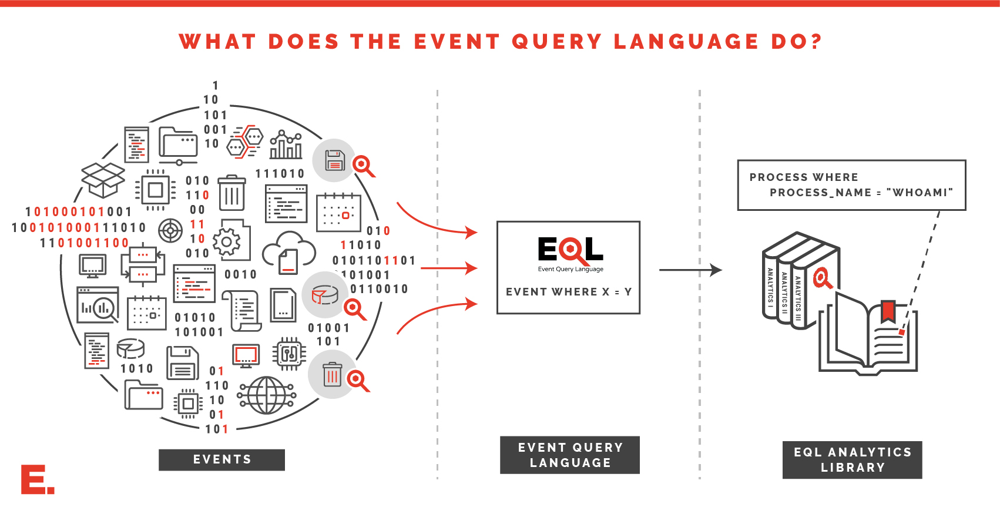

# Event Query Language
[](https://pypi.python.org/pypi/eql)
[](https://gitter.im/eventquerylang/community?utm_source=badge&utm_medium=badge&utm_campaign=pr-badge)
[](https://eql.readthedocs.io/en/latest/?badge=latest)
[](https://www.gnu.org/licenses/agpl-3.0)

[](https://twitter.com/eventquerylang)


Browse a [library of EQL analytics](https://eqllib.readthedocs.io)

# Getting Started

The EQL module current supports Python 2.7 and 3.5+. Assuming a supported Python version is installed, run the command:

```console
$ pip install eql
```

If Python is configured and already in the PATH, then ``eql`` will be readily available, and can be checked by running the command:

```console
$ eql --version
eql 0.8
```

From there, try a [sample json file](docs/_static/example.json) and test it with EQL.

```console
$ eql query -f example.json "process where process_name == 'explorer.exe'"
{"command_line": "C:\\Windows\\Explorer.EXE", "event_type": "process", "md5": "ac4c51eb24aa95b77f705ab159189e24", "pid": 2460, "ppid": 3052, "process_name": "explorer.exe", "process_path": "C:\\Windows\\explorer.exe", "subtype": "create", "timestamp": 131485997150000000, "user": "research\\researcher", "user_domain": "research", "user_name": "researcher"}
```

# Next Steps
- Browse a [library of EQL analytics](https://eqllib.readthedocs.io)
- Check out the [query guide](https://eql.readthedocs.io/en/latest/query-guide/index.html) for a crash course on writing EQL queries
- View usage for interactive [shell](https://eql.readthedocs.io/en/latest/cli.html)
- Explore the [API](https://eql.readthedocs.io/en/latest/api/index.html) for advanced usage or incorporating EQL into other projects
